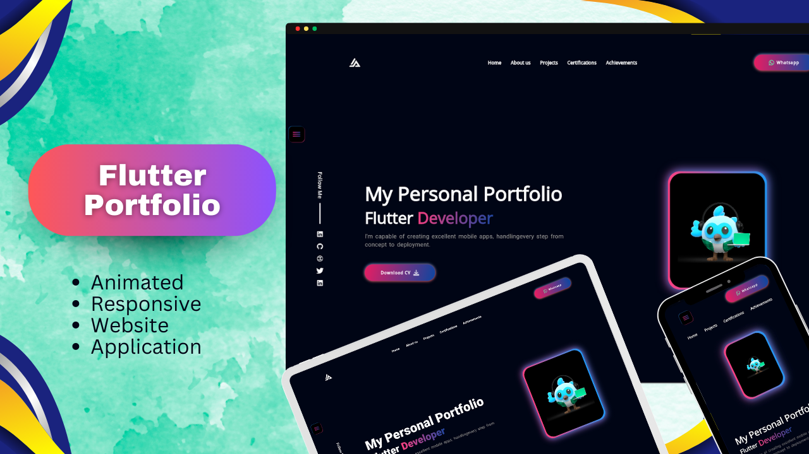

<div align="center">

# 🚀 Flutter Responsive Portfolio WebApp

[](https://flutter.dev/)
[](https://dart.dev/)
[](https://firebase.google.com/)
[](LICENSE)
[](https://flutter.dev/)
[](https://pub.dev/packages/get)

*A modern, responsive portfolio website built with Flutter that showcases projects, certifications, and professional information with elegant animations and cross-platform compatibility.*

[](https://hamad-anwar.github.io/Portfolio/#/)
[](showcase.png)

</div>

---

## 📱 Screenshots

<div align="center">
  
</div>

---

## ✨ Features

### 🎨 **Responsive Design**
- **Cross-Platform Compatibility**: Works seamlessly on Desktop, Tablet, and Mobile devices
- **Adaptive Layout**: Automatically adjusts UI components based on screen size
- **Touch-Friendly**: Optimized for both mouse and touch interactions

### 🚀 **Modern UI/UX**
- **Material Design 3**: Latest Material Design principles and components
- **Smooth Animations**: Elegant transitions and micro-interactions
- **Dark Theme**: Eye-friendly dark color scheme
- **Custom Typography**: Google Fonts integration for beautiful text rendering

### 📂 **Portfolio Sections**
- **🏠 Home**: Landing page with introduction and navigation
- **💼 Projects**: Interactive project showcase with detailed information
- **🏆 Certifications**: Professional achievements and certifications display
- **📞 Contact**: Multiple ways to get in touch

### 🔧 **Technical Features**
- **State Management**: GetX for efficient state management
- **Image Viewer**: Enhanced photo viewing experience
- **External Links**: Seamless integration with social media and project links
- **Firebase Integration**: Backend services and analytics

---

## 🛠️ Tech Stack

<div align="center">

### **Frontend Framework**


### **State Management & Navigation**


### **Backend & Services**


### **UI/UX Libraries**


### **Utilities**


</div>

---

## 📦 Dependencies

| Package | Version | Purpose |
|---------|---------|---------|
| `flutter` | SDK | Core Flutter framework |
| `google_fonts` | ^6.2.1 | Beautiful typography |
| `flutter_svg` | ^2.1.0 | SVG image rendering |
| `get` | ^4.7.2 | State management & navigation |
| `photo_view` | ^0.15.0 | Enhanced image viewing |
| `url_launcher` | ^6.3.1 | External link handling |
| `font_awesome_flutter` | ^10.8.0 | Icon library |
| `firebase_core` | ^3.15.1 | Firebase integration |

---

## 🚀 Getting Started

### Prerequisites

- [Flutter SDK](https://flutter.dev/docs/get-started/install) (3.0.2 or higher)
- [Dart SDK](https://dart.dev/get-dart) (3.0.2 or higher)
- [Git](https://git-scm.com/)
- [Android Studio](https://developer.android.com/studio) or [VS Code](https://code.visualstudio.com/)

### Installation

1. **Clone the repository**
   ```bash
   git clone https://github.com/Hamad-Anwar/Flutter-Responsive-Portfolio-WebApp.git
   cd Flutter-Responsive-Portfolio-WebApp
   ```

2. **Install dependencies**
   ```bash
   flutter pub get
   ```

3. **Run the application**
   ```bash
   # For web
   flutter run -d chrome
   
   # For Android
   flutter run -d android
   
   # For iOS
   flutter run -d ios
   ```

### Build for Production

```bash
# Web build
flutter build web

# Android build
flutter build apk

# iOS build
flutter build ios
```

---

## 📁 Project Structure

```
lib/
├── main.dart                 # App entry point
├── firebase_options.dart     # Firebase configuration
├── model/                    # Data models
│   ├── certificate_model.dart
│   └── project_model.dart
├── res/
│   └── constants.dart        # App constants
├── view/                     # UI screens
│   ├── certifications/       # Certifications section
│   ├── home/                 # Home screen
│   ├── intro/                # Introduction components
│   ├── main/                 # Main navigation
│   ├── projects/             # Projects section
│   └── splash/               # Splash screen
└── view model/               # Business logic
    ├── controller.dart
    ├── getx_controllers/
    └── responsive.dart
```

---

## 🎯 Key Features Explained

### **Responsive Design**
The app uses Flutter's responsive design principles with:
- **MediaQuery**: Dynamic sizing based on screen dimensions
- **Flexible Widgets**: Adaptive layouts using `Flex`, `Expanded`, and `Flexible`
- **Breakpoint System**: Different layouts for mobile, tablet, and desktop

### **State Management with GetX**
- **Reactive Programming**: Automatic UI updates when data changes
- **Dependency Injection**: Clean architecture with service locator pattern
- **Route Management**: Declarative routing with GetX navigation

### **Firebase Integration**
- **Analytics**: Track user interactions and app performance
- **Hosting**: Web deployment on Firebase Hosting
- **Future Expansion**: Ready for authentication, database, and more

---

## 🌟 Live Demo

**Experience the portfolio live:** [https://hamad-anwar.github.io/Portfolio/#/](https://hamad-anwar.github.io/Portfolio/#/)

---

## 🤝 Contributing

We welcome contributions! Here's how you can help:

1. **Fork the repository**
2. **Create a feature branch** (`git checkout -b feature/AmazingFeature`)
3. **Commit your changes** (`git commit -m 'Add some AmazingFeature'`)
4. **Push to the branch** (`git push origin feature/AmazingFeature`)
5. **Open a Pull Request**

### Contribution Guidelines
- Follow Flutter coding conventions
- Add comments for complex logic
- Test your changes on multiple screen sizes
- Update documentation if needed

---

## 📞 Contact

<div align="center">

**Hamad Anwar** - *Flutter Developer*

[](mailto:rh676838@gmail.com)
[](https://www.linkedin.com/in/hamad-anwar)
[](https://github.com/Hamad-Anwar)

</div>

---

## 📄 License

This project is licensed under the MIT License - see the [LICENSE](LICENSE) file for details.

---

<div align="center">

### ⭐ **Star this repository if you found it helpful!**

**Made with ❤️ by [Hamad Anwar](https://www.linkedin.com/in/hamad-anwar/)**

[](https://flutter.dev/)
[](https://firebase.google.com/)

</div>
